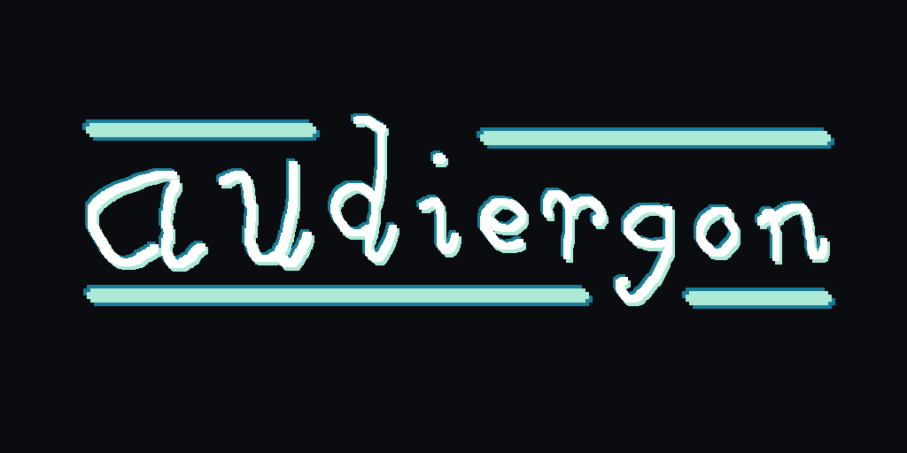

<div align="center">
  
</div>

<div align="center">
    <h1>Audiergon</h1>
</div>

<div align="center">
    <h5> 
        <a href="#">☁️ Cloud Demo (WIP)</a> | 
        <a href="https://pypi.org/project/audiergon/">🐍 PyPI page</a> | 
        <a href="https://youtube.com/playlist?list=PLAbLVCg6_PqQ&si=2yWFeVAcUrOT_ob_">▶️ YouTube Series</a> | 
        <a href="https://audiergon.readthedocs.io/en/latest/">📝 Docs</a>
  </h5>
</div>

A suite of audio-related tools built with Python and AWS to demonstrate the use of the Fourier Transform!

## Project Outline
Audiergon has two main parts: Audiergon local and Audiergon cloud.
* You can find the local Python implementation of the `audiergon` library and its apps in the `audiergon/` directory.
    * Inside this directory, `audiergon/` is the Python library.
    * `apps/` contains the Gradio interface for EQ Control and Fourier Analysis, as well as standalone Fourier Analysis tools
    * `docs/` contains the ReadTheDocs configuration information for the documentation.
* You can find the cloud implementation of Audiergon in the `cloud/` directory.
    * WIP: Writing the CDK template and frontend for EQ Control in the cloud.

## Project Features

### 1 - `audiergon` Python Library
The basis of the project, containing many algorithm implementations built from scratch for Digital Signal Processing.
* **Cooley-Tukey FFT Processor** 
    * A pure Python implementation of the iterative Fast Fourier Transform and Inverse Fast Fourier Transform (`iterative_fft()`, `iterative_ifft()`, `iterative_fftfreq`).
* **Windowing & Overlap-Add**
    * Built-in support for Hann windowing and Overlap-Add (OLA) processing (`generate_hann_window()`, `process_audio()`)
* **Utility Algorithms**
    * Algorithms such as `bit_reverse()` and `apply_equaliser()`

### 2 - Local Applications
Interactive standalone tools located in the `apps/` directory to run on your local machine
* **Gradio EQ Filter UI**
    * A web-based local interface that lets you upload audio files, visualise their frequency components, and dynamically adjust frequency bins using the FFT. (`app.py`)
* **Static Fourier Analysis**
    * A graphing tool that breaks down any mono PCM .wav file into its distinct Frequency Domain and Time Domain graphs. (`fourier_analysis.py`)
* **Live Fourier Analysis**
    * A real-time analysis tool that uses your microphone to visualise the sound frequencies of your environment in real time. (`live_fourier_analysis.py`)

### 3 - AWS Cloud Implementation (WIP)
Coming soon!

## Getting Started

### Local Audiergon App
#### Prerequisites
* Python 3.9 or higher
#### Local Installation
Clone the repository and install the dependencies:
```bash
git clone https://github.com/hamdivazim/Audiergon.git
cd Audiergon
pip install .
```
Go into `audiergon/apps` and try out any of the available apps.

### Cloud Audiergon (WIP)
You can use my hosted instance online at any time, or you can host your own.

#### Self-hosting Cloud Audiergon
Clone the repository:
```bash
git clone https://github.com/hamdivazim/Audiergon.git
```
Navigate to `cloud/` and use the CDK template.

## Contributing
Audiergon is a 100% open source project! Any contributions are greatly appreciated :)

1. Fork the Project
2. Create your Feature Branch (`git checkout -b feat/your-feature`)
3. Commit your Changes (`git commit -m 'Add a new feature'`)
4. Push to the Branch (`git push origin feat/your-feature`)
5. Open a Pull Request

*If you find this project helpful or interesting, please consider leaving a ⭐ star on the repository to show your support!*

## Devlog

Check out the [Audiergon Devlog Playlist](https://youtube.com/playlist?list=PLAbLVCg6_PqQ&si=2yWFeVAcUrOT_ob_) on YouTube for a detailed run-through of the theory behind the Fourier Transform!

<kbd>
<a href="https://youtube.com/playlist?list=PLAbLVCg6_PqQ&si=2yWFeVAcUrOT_ob_"></a>
</kbd>

### 

Check out [Audiergon Devlog Part 1](https://youtu.be/Kwgaz00gUXw) on YouTube for a detailed run-through of the theory behind the Fourier Transform!

<kbd>
<a href="https://youtu.be/Kwgaz00gUXw"></a>
</kbd>

## License
Audiergon is licensed under the [MIT License](LICENSE)