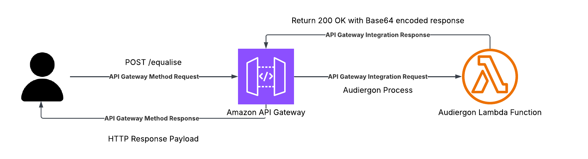

# Audiergon AWS Architecture Rationale

This document outlines the architectural decisions and security guardrails implemented in Audiergon's serverless backend infrastructure.

## Architectural Overview

The backend uses a completely serverless layout using Amazon API Gateway (HTTP API) and AWS Lambda.

### Compute & Cost Optimization (1024MB RAM)

* Allocating more memory to Lambda scales the available vCPU linearly. FFTs are CPU-intensive (lots of maths operations) so running the engine at lower memory profiles (512MB) causes execution times to drag out (27s for a 5s clip in experience).
* Billed execution time is measured in gigabyte-seconds. I doubled the memory allocation (and CPU allocation) to 1024MB, and this reduced processing time to about 14s. Overall, this keeps the GBs the same while doubling processing speed.

### API Throttling & DDoS Mitigation

Because the serverless backend is public-facing, it is vulnerable to malicious scraping or deliberate cost-exhaustion attacks. Guardrails are enforced directly at the API Gateway routing layer using standard Token Bucket throttling:

* Rate Limit: 2 requests per second.
* Burst Limit: 5 concurrent requests.

Invalid or high-velocity requests are dropped immediately with a `429 Too Many Requests` status code before they ever invoke the underlying Lambda.

### Execution Timeout Constraints (29 Seconds)

The Lambda function is allocated an execution timeout of 29 seconds. This choice directly correlates to the internal hard timeout limit of Amazon API Gateway (which returns a `504 Gateway Timeout` at 30 seconds). Provisioning the Lambda to run any longer would result in compute operations running in the background after the API client connection has already closed.

## Payload & Data Processing Guardrails

The Lambda execution wrapper has many data validation controls to catch processing failures early and minimise wasted FFT execution (which would drive the GBs figure up).

### Layered Payload Size Audits

* Before fully decoding the incoming payload, the handler checks the base64 string length against a maximum size limit (`2,097,152` characters). If the string exceeds this, it is immediately discarded with a  `413 Payload Too Large` error.
* Valid audio files are written straight to `/tmp/input.wav`, avoiding in-memory byte buffers.

### Wave Container Validation

Once written to storage, the `wave` library performs multiple checks on the audio file. Consider this another line of defense (as it is still expensive to load the audio file in) before the FFT begins processing.

* Validates that the audio channel structure is strictly Mono (`nchannels == 1`).
* Ensures the payload utilizes standard 16-bit depth bounds (`sampwidth == 2`).
* Checks total frames against the sampling frequency (`nframes / framerate`). If the audio clip exceeds 5.1 seconds, execution is stopped.

## Client-side Architectural Decisions

* The API URL is intentionally never placed within the HTML of the frontend to make it harder for scrapers to find the URL and abuse it
* The client side also has a layer to check filesize and audio length. Without client-side tampering this is also likely to reduce API Gateway method requests that are unnecessary.